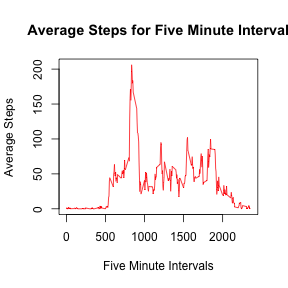

Reproducible Research Week 2 Peer Review
========================================

### Introduction

It is now possible to collect a large amount of data about personal movement using activity monitoring devices such as a Fitbit, Nike Fuelband, or Jawbone Up. These type of devices are part of the "quantified self" movement -- a group of enthusiasts who take measurements about themselves regularly to improve their health, to find patterns in their behavior, or because they are tech geeks. But these data remain under-utilized both because the raw data are hard to obtain and there is a lack of statistical methods and software for processing and interpreting the data.

This assignment makes use of data from a personal activity monitoring device. This device collects data at 5 minute intervals through out the day. The data consists of two months of data from an anonymous individual collected during the months of October and November, 2012 and include the number of steps taken in 5 minute intervals each day.

The variables included in this dataset are:

steps: Number of steps taking in a 5-minute interval (missing values are coded as NA)

date: The date on which the measurement was taken in YYYY-MM-DD format

interval: Identifier for the 5-minute interval in which measurement was taken

The dataset is stored in a comma-separated-value (CSV) file and there are a total of 17,568 observations in this dataset.

(Disclosure: The above information is taken from assignment)

### What is mean total number of steps taken per day?

1. Make a histogram of the total number of steps taken each day


```r
activity<-read.csv("activity.csv")
activity.group.by.date<-group_by(activity,date)
#Calculate the total number of steps taken per day
totalsteps<-summarize(activity.group.by.date,steps.per.day=sum(steps,na.rm=T))
hist(totalsteps$steps.per.day,xlab="Total Steps per day",main="Total Steps per day Histogram",col="red")
```


2. Calculate and report the mean and median total number of steps taken per day


```r
#Calculate and report the mean and median of total number of steps per day
meansteps<-mean(totalsteps$steps.per.day)
mediansteps<-median(totalsteps$steps.per.day)
```

- The mean number of steps are : **9354.2295082** steps
- The median number of steps are : **10395** steps

### What is the average daily activity pattern
1. Make a time series plot (i.e. type = "l") of the 5-minute interval (x-axis) and the average number of steps taken, averaged across all days (y-axis)


```r
activity.group.by.interval<-group_by(activity,interval)
five.minute.interval<-summarize(activity.group.by.interval,avg.steps=mean(steps,na.rm=T))
plot(five.minute.interval$interval,five.minute.interval$avg.steps,type="l",xlab="Five Minute Intervals",ylab="Average Steps",main="Average Steps for Five Minute Interval",col="red")
```



2. Which 5-minute interval,on average across all the days in the dataset, contains the maximum number of steps?

```r
 #Order the five minute interval data set in descending order
sorted.five.minute.interval<-arrange(five.minute.interval,desc(avg.steps))
```

The 5-minute interval across all the days in the dataset that contains the maximum number of steps is : **835** interval

###Imputing missing values and performing the analysis

1. Calculate and report the total number of missing values in the dataset (i.e. the total number of rows with NAs)


```r
missing.values<-sum(is.na(activity$steps))
```

The number of missing values in the dataset : **2304**


2. Devise a strategy for filling in all of the missing values in the dataset. The strategy does not need to be sophisticated. For example, you could use the mean/median for that day, or the mean for that 5-minute interval, etc

3. Create a new dataset that is equal to the original dataset but with the missing data filled in.

Solution: Calculate the average number of steps for each five minute interval across all days and store under avg.steps column in five.minute.interval dataset. This dataset is already calculated in the above steps. Then for any five minute interval in the original dataset (activity) that is NA use that average number of steps in the five.minute.interval dataset as the new value. The new dataset is called activity.Imputing.Missing.Values. The new dataset will now have all NAs replaced by the average steps in the five minute interval.


```r
# Create a new dataset
activity.Imputing.Missing.Values<-activity

#Loop over new dataset using for loop to find missing values, once found, find the 5-minute interval that has missing value, now loop over the five minuter interval data set which has average steps, assign that value to the NA, now the new dataset will have values with NA replaced with average steps in that five minute interval

for(i in 1:length(activity.Imputing.Missing.Values$steps)) 
{  
        if(is.na(activity.Imputing.Missing.Values$steps[i]))
      {            
              t<-activity.Imputing.Missing.Values$interval[i]       
              for(j in 1:length(five.minute.interval$interval))
                {
                      if(five.minute.interval$interval[j]==t)
                      {
                              activity.Imputing.Missing.Values$steps[i] = five.minute.interval$avg.steps[j]    
                      }
                }
      }
}
```

4. Make a histogram of the total number of steps taken each day and Calculate and report the mean and median total number of steps taken per day. Do these values differ from the estimates from the first part of the assignment? What is the impact of imputing missing data on the estimates of the total daily number of steps?


```r
activity.Imputing.Missing.Values.group.by.date<-group_by(activity.Imputing.Missing.Values,date)
totalsteps<-summarize(activity.Imputing.Missing.Values.group.by.date,steps.per.day=sum(steps,na.rm=T))
hist(totalsteps$steps.per.day,xlab="Total Steps Per Day",main="Total Steps per Day Histogram",col="red")
```


```r
meansteps<-mean(totalsteps$steps.per.day)
mediansteps<-median(totalsteps$steps.per.day)
```

- The mean number of steps are : **1.0766189 &times; 10<sup>4</sup>** steps
- The median number of steps are : **1.0766189 &times; 10<sup>4</sup>** steps

Yes, the values differ from the first part of the assignment. Since we have replaced NAs with a average number of steps in that five minute interval, the number of steps increased.

As indicated by the Mean and Median number of steps above, the total daily number of steps have increased after replacing the NAs.


###Are there differences in activity patterns between weekdays and weekends?

For this part the weekdays() function may be of some help here. Use the dataset with the filled-in missing values for this part.

1. Create a new factor variable in the dataset with two levels -- "weekday" and "weekend" indicating whether a given date is a weekday or weekend day.


```r
activity.Imputing.Missing.Values$date<-as.Date(as.factor(activity.Imputing.Missing.Values$date))
activity.Imputing.Missing.Values$WeekDay<-NA
f<-function(x) 
{ 
        if (weekdays(x)=="Sunday" | weekdays(x)=="Saturday")
         {           
                 x <- "Weekend"
         }
         else
                 {
                         x <- "Weekday"
                }
}
activity.Imputing.Missing.Values$WeekDay<- sapply(activity.Imputing.Missing.Values$date,f)
activity.Imputing.Missing.Values$WeekDay<-as.factor(activity.Imputing.Missing.Values$WeekDay)
activity.Imputing.Missing.Values<- activity.Imputing.Missing.Values %>% group_by(WeekDay,interval) %>% summarize_each(funs(mean))
```

```
## `summarise_each()` is deprecated.
## Use `summarise_all()`, `summarise_at()` or `summarise_if()` instead.
## To map `funs` over all variables, use `summarise_all()`
```


2. Make a panel plot containing a time series plot (i.e. type = "l") of the 5-minute interval (x-axis) and the average number of steps taken, averaged across all weekday days or weekend days (y-axis). 


```r
qplot(interval,steps,data=activity.Imputing.Missing.Values,facets=WeekDay~.,geom="line",xlab="5 Minute Intervals",ylab="Number of Steps",main="Comparing Weekday & Weekend Activity")
```


